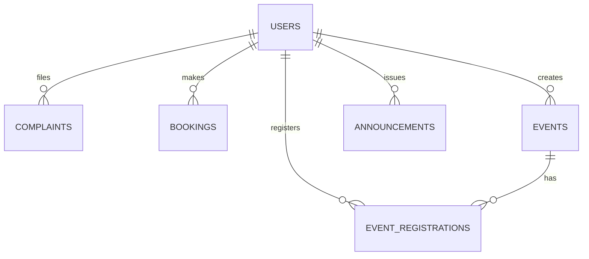

# Database schema (SQLite)

Location: `schema.sql` (project root) — the application uses `sqlite:///./chattan.db` by default.

## Overview
- SQLite database file: `chattan.db`.
- Main entities: `users`, `events`, `event_registrations`, `complaints`, `bookings`, `announcements`.
- `event_registrations` is a join table implementing a many-to-many relationship between `users` and `events`.

## ER diagram (simplified)

## Tables (summary)

- users
  - id INTEGER PRIMARY KEY
  - name TEXT
  - email TEXT UNIQUE NOT NULL
  - password_hash TEXT NOT NULL
  - role TEXT DEFAULT 'student' (values: `student`, `admin`, `staff`)
  - phone VARCHAR(32)
  - created_at DATETIME

- events
  - id, title, description, date (DATETIME), venue, capacity, created_by (FK -> users.id), created_at

- event_registrations
  - id, event_id (FK -> events.id), user_id (FK -> users.id), registered_at
  - (application enforces uniqueness of user+event)

- complaints
  - id, user_id (FK -> users.id), title, description, category, status, assigned_to (FK -> users.id), image_path, created_at
  - image uploads stored in `app/static/uploads/`

- bookings
  - id, user_id (FK -> users.id), room_name, date, start_time, end_time, status, created_at
  - application checks for overlapping approved bookings

- announcements
  - id, title, content, created_by (FK -> users.id), created_at, attachment

## Important constraints / indexes
- `users.email` is UNIQUE and indexed.
- Foreign keys link child records to `users`, `events` (see `schema.sql`).
- Composite uniqueness for registrations is enforced at application level (you should avoid duplicate registrations client-side/server-side).

## How to create / update the DB
- Manual (sqlite):
  - sqlite3 chattan.db < schema.sql
- Automatic (recommended during development):
  - The app creates missing tables at startup via SQLAlchemy (`Base.metadata.create_all(bind=engine)`).

## Notes about SQLite
- Dates/times are stored as TEXT/ISO strings by SQLAlchemy's Date/DateTime mapping.
- Foreign key enforcement is enabled in `schema.sql` with `PRAGMA foreign_keys = ON`.

For the full DDL, see `schema.sql` in the repository root.